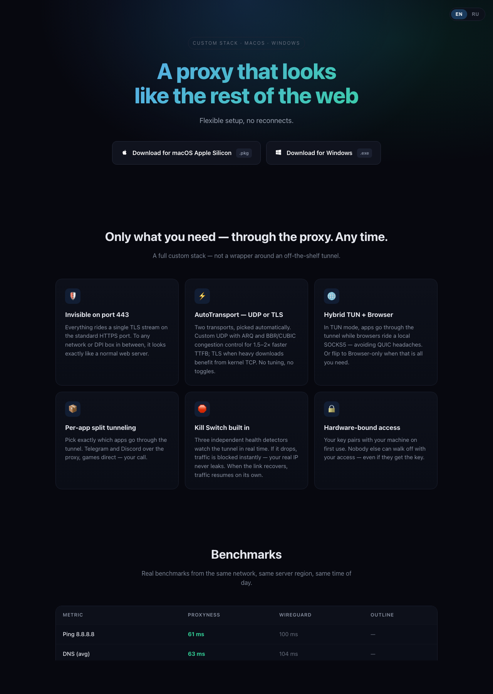
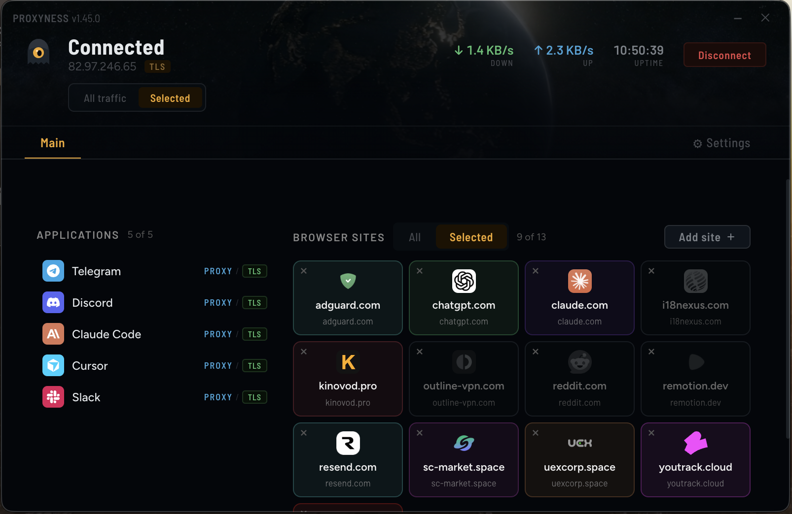
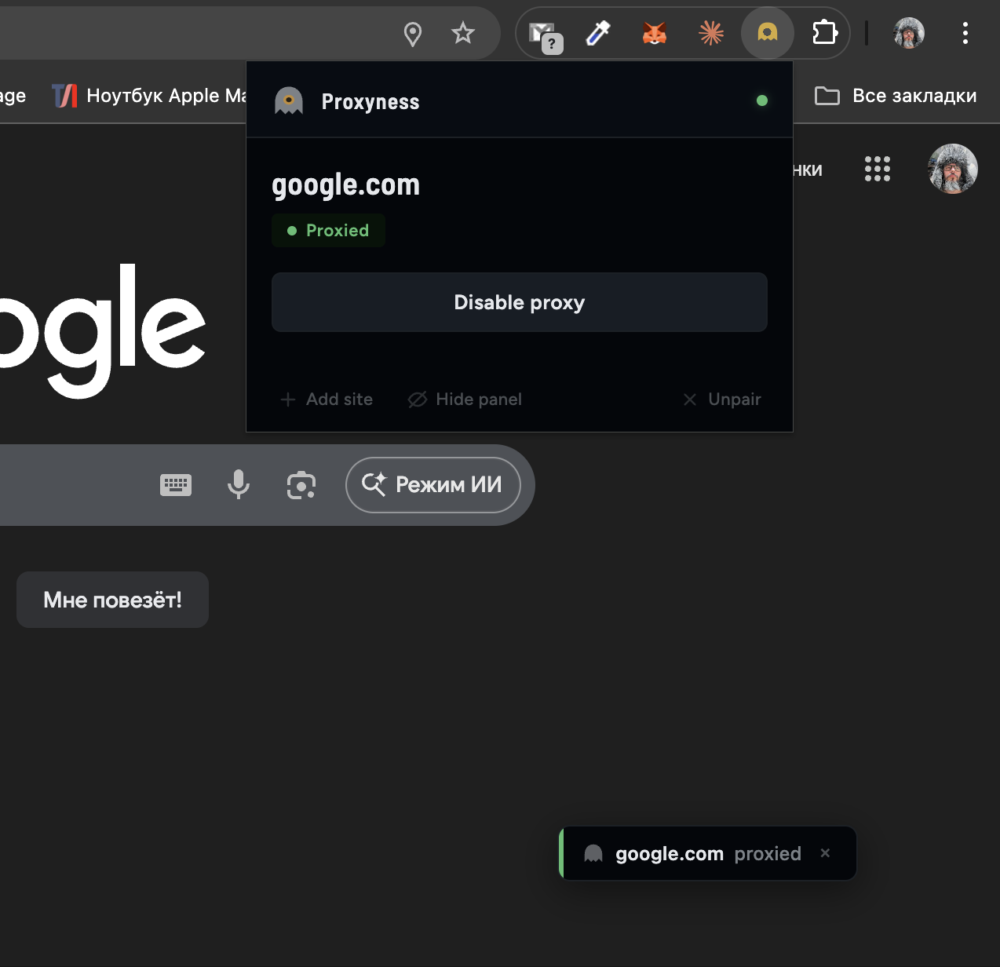
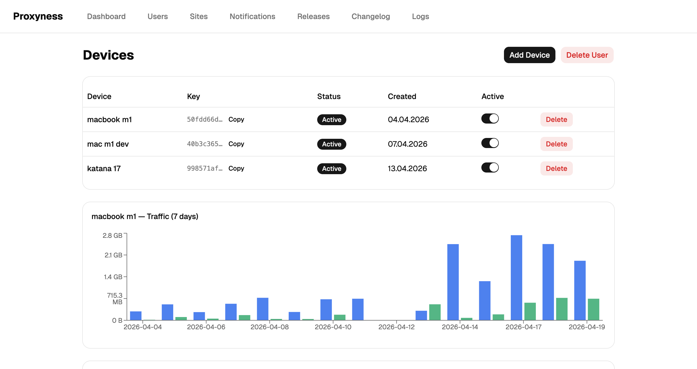
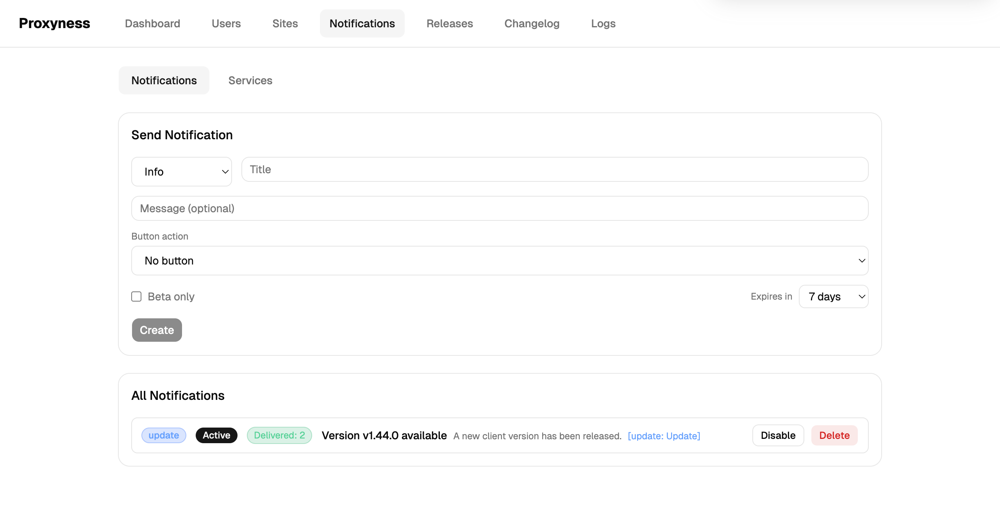
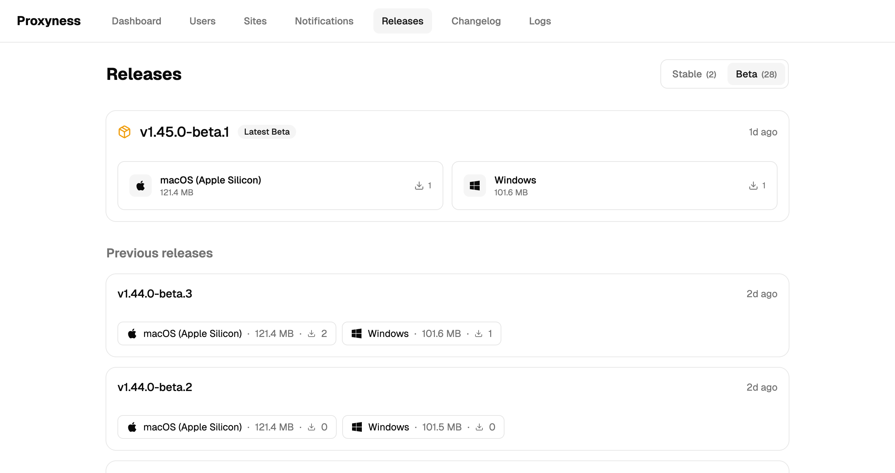
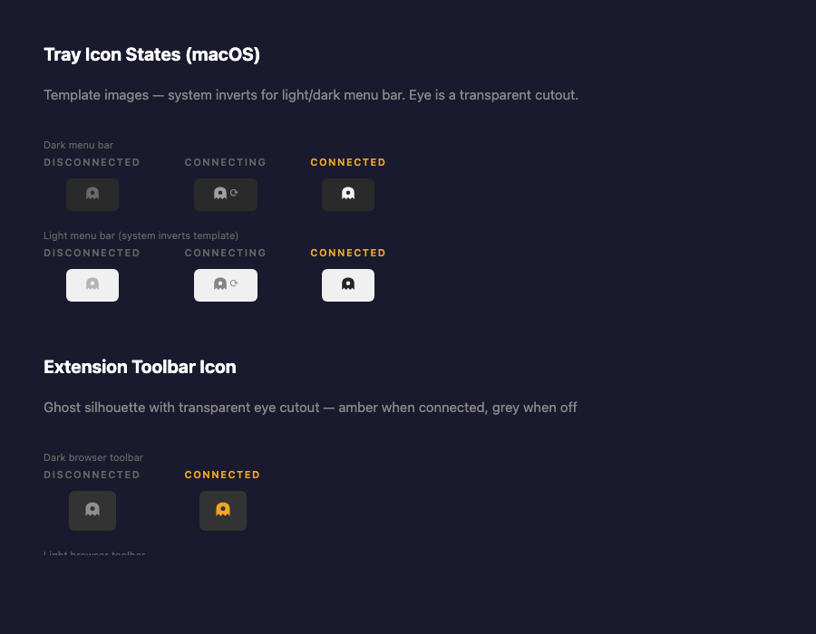

# Proxyness

[](https://github.com/ilyasmurov/proxyness/releases)
[](LICENSE)
[](https://github.com/ilyasmurov/proxyness/releases)
[](https://github.com/ilyasmurov/proxyness/commits/main)

Proxyness carries your traffic through a single TLS stream on port 443. To any network or DPI box between you and the server, it is indistinguishable from a normal HTTPS web server — same SNI, same Let's Encrypt certificate, same ALPN. No protocol fingerprint to match on.

**Landing & downloads:** https://proxyness.smurov.com



---

## What is this for?

In jurisdictions with aggressive DPI-based blocking, commodity VPN protocols — WireGuard, OpenVPN, Shadowsocks — get fingerprinted and nullified within hours of activation. Proxyness sidesteps this by speaking real TLS on real port 443, behind a real domain name with a real certificate. Blocking Proxyness means blocking the open web.

This repository holds the full stack: server, daemon, helper, desktop client, admin dashboard, browser extension, and config service.

## Features

- **Looks like HTTPS.** Genuine TLS 1.3 on port 443. Same wire shape as any modern web server.
- **Two transports, auto-picked.** Kernel TCP for heavy downloads; a custom UDP channel (QUIC-shaped outer frame, XChaCha20-Poly1305 inner payload) for lower time-to-first-byte. Switches transparently.
- **Hybrid TUN + SOCKS5.** Apps (Telegram, Discord, games) ride a system-wide TUN device; browsers ride a local SOCKS5 listener, sidestepping QUIC entirely.
- **Per-app split tunneling.** Pick which apps go through the tunnel and which stay direct.
- **Kill-switch by default.** Four independent health detectors (D1–D4) watch the tunnel; traffic blocks instantly on loss and resumes when the link recovers. Real IP never leaks.
- **Device binding.** Your key is pinned to a hardware fingerprint on first connect — stolen keys don't transfer to another machine.
- **Dual-VPS failover.** Two servers in Amsterdam (Aeza + Timeweb). The client picks at runtime; rolling deploys never take both down at once.
- **Browser extension.** Per-site routing visibility + one-click rule adds.
- **Admin dashboard.** Live connection counts, per-user traffic, device management, notification push.

## Quick start

### For users

This repo is the source. If you just want to *use* Proxyness, grab the installer from [proxyness.smurov.com](https://proxyness.smurov.com) — macOS (arm64 / x64) and Windows (x64). Paste your device key on first launch, connect, done. No config files, no CLI.

**Need a device key?** The service is in closed beta — keys are handed out manually. If you'd like to try it, email [ilya@smurov.com](mailto:ilya@smurov.com) and I'll send you a free key good for one device.

### For developers

Self-hosting the server and building the client from source are realistic but not turnkey — see [Building from source](#building-from-source) below.

## Screenshots

### Desktop client

Main window, per-app + per-site routing. `All traffic` sends everything through the tunnel; `Selected` (shown) routes only the listed apps and browser sites.



### Browser extension

Popup opens from the Chrome toolbar showing the current site's status and a one-click proxy toggle. A small draggable floating panel on every page surfaces the same status without opening the popup.



### Admin dashboard

Lives at `admin.proxyness.smurov.com`, behind Basic Auth. Communicates with the proxy server over REST + SSE — no direct database access.

**User detail** — per-device keys, active toggle, and a 7-day traffic chart (blue = download, green = upload).



**Notifications** — push update / maintenance / info banners to all connected clients; delivery is tracked per device.



**Releases** — download counts per build, stable vs. beta split.



### Tray icons

Ghost silhouette with a transparent eye cutout — open eye when connected, closed eye when idle. Template images on macOS so the menu bar auto-inverts for light/dark themes.



---

## How it works

```
                    ┌─ Browsers ──→ System SOCKS5 proxy (:1080) ─┐
Client App ─────────┤                                             ├─→ TLS → Server (:443)
                    └─ Apps ──→ TUN device ──→ Helper relay ──→   │
                                  Daemon (gVisor netstack) ───────┘
                                                                   ↓
                                                             Peek first byte
                                                             0x01 → TCP relay
                                                             0x02 → UDP relay
                                                             HTTP → Admin / landing
```

One TCP listener on the server handles three distinct protocols. The `ListenerMux` peeks the first byte: binary `0x01` starts a TCP proxy session; `0x02` starts a UDP-over-TLS session; anything else (starts with `GET`, `POST`, etc.) is routed to the HTTP admin API. All three share the same port and the same certificate.

On the client side, the Electron app spawns a local **daemon** (for SOCKS5 + TUN) and a privileged **helper** (for owning the TUN device). Apps that talk to the tunnel hit either the TUN device (routed by the kernel) or the SOCKS5 listener at `127.0.0.1:1080`.

Deeper per-module details live in [`docs/claude/architecture.md`](docs/claude/architecture.md). It's written for Claude Code but reads fine for humans.

## Repository layout

```
.
├── server/            # Go TLS proxy server — multiplexes proxy + admin on :443
├── daemon/            # Go local daemon — SOCKS5 listener + gVisor TUN engine
├── helper/            # Go privileged helper — owns the TUN device
├── client/            # Electron + React + TypeScript desktop app
├── admin/             # React SPA admin dashboard (admin.proxyness.smurov.com)
├── extension/         # Chrome MV3 browser extension
├── config/            # Go microservice for push notifications to the client
├── landing/           # Static landing page (proxyness.smurov.com)
├── pkg/               # Shared Go packages — auth, wire protocol, machine ID
├── test/              # Go end-to-end integration tests
├── docs/claude/       # Extended developer documentation (architecture, deploy, design decisions)
└── scripts/           # Setup, benchmark, and ops scripts
```

Six Go modules share a single workspace (`go.work`).

## Building from source

### Prerequisites

- **Go** 1.26+ (matches `go.work`)
- **Node** 20+ (for Electron + Vite)
- **Xcode command-line tools** (macOS) or **MSVC build tools** (Windows) — for Electron native deps
- **Docker** (only if you intend to build and push the server image yourself)
- **Make**

### Commands

```bash
# Run all Go tests (pkg, daemon, server, test)
make test

# Build the server binary (Linux amd64 → dist/proxy-server)
make build-server

# Build daemon binaries (macOS arm64/amd64 + Windows amd64 → dist/daemon-*)
make build-daemon

# Build helper binaries (macOS arm64/amd64 + Windows amd64 → dist/helper-*)
make build-helper

# Build and package the Electron client (PKG on macOS, NSIS on Windows)
make build-client

# Run the client in dev mode (Vite HMR + local daemon)
make dev

# Clean build artifacts
make clean
```

Run a single Go test:

```bash
cd server && go test ./internal/db/ -run TestDeviceCRUD -v
```

### Self-hosting the server

The server is a single Go binary behind nginx (acting as SNI-based TCP router). You will need:

- A Linux VPS with a public IPv4 and ports 443/tcp + 443/udp open.
- A domain name pointing at the VPS.
- A Let's Encrypt certificate (`scripts/setup-ssl.sh` automates this).
- Postgres 16 (can run on the same box — see [`docs/claude/deploy.md`](docs/claude/deploy.md) for the exact setup used in production).

The deploy pipeline (`.github/workflows/deploy.yml`) builds a container and rolls it onto the two production VPSs; for a single-host setup you can skip GitHub Actions and use `docker run` directly. The server binary reads its Postgres URL from an env file at `/etc/proxyness/db.env`.

The client's server list is hard-coded in `client/src/renderer/App.tsx` (the `SERVERS` const). Change it to point at your host.

### Client dev notes

- `make dev` enables CORS on the daemon API — the Vite renderer at `http://localhost:5174` is cross-origin with the daemon at `127.0.0.1:9090`.
- macOS system-proxy changes require sudo; the dev entry prompts via `osascript`.
- Windows helper needs Administrator; elevation is requested via the manifest.

## Deployment

Every deploy is tag-triggered via GitHub Actions. Pushing to `main` deploys nothing.

| Component | Tag pattern | Example |
|-----------|-------------|---------|
| Server + admin | `server-*` | `server-2.5.5` |
| Landing page | `landing-*` | `landing-1.2.0` |
| Config service | `config-*` | `config-1.0.0` |
| Admin dashboard | `admin-*` | `admin-1.2.1` |
| Client (stable) | `v*` | `v1.45.0` |
| Client (beta) | `v*-beta.*` | `v1.45.0-beta.1` |

Full deployment topology, VPS specifics, Postgres/WireGuard setup, and the SNI router config are documented in [`docs/claude/deploy.md`](docs/claude/deploy.md).

## Project status

Beta. Running for a small test group since early 2026. Tech stack is stable; client and server ship 2–3 releases a week.

Two VPSs in Amsterdam:

- **Aeza NL** — primary. Hosts Postgres, admin dashboard, config service.
- **Timeweb NL** — secondary. Shares Postgres with Aeza over a private WireGuard tunnel (`10.88.0.0/24`).

The client picks a server at runtime and fails over automatically during rolling deploys.

## Security model

Proxyness is an **anti-censorship** tool — not a general-purpose no-logs VPN. Assumptions:

- The server operator is trusted. They observe the destination domain of each new TCP/UDP stream (from the proxy `Connect` message); they do not see decrypted payloads.
- TLS is the outer envelope. The UDP transport additionally encrypts payloads with XChaCha20-Poly1305 under a shared X25519 secret, so a compromised TLS middle doesn't read UDP content.
- Client-side TLS cert verification is disabled (`InsecureSkipVerify`). Authentication is HMAC-SHA256 over the device key with a 30-second timestamp window; CA trust is not part of the trust model.
- Device keys are 32 random bytes, delivered to users out of band. First connect binds the key to a 16-byte machine fingerprint; later connects from a different machine are rejected until the binding is reset by the admin.

If your threat model needs hidden operator logs or plausible deniability against a forensic examiner who owns your client machine, this is the wrong shape. If your threat model is "my ISP and a national DPI system cooperate to block commodity VPNs, I need something that doesn't look like a VPN", this is the right shape.

## Contributing

This is a personal / small-team project. External PRs are welcome, but please open an issue first to check that the direction fits. There is no formal contribution process yet — treat it as "ping the maintainer".

Bug reports, security issues, or general questions: open a GitHub issue or email [ilya@smurov.com](mailto:ilya@smurov.com).

## License

[GNU Affero General Public License v3.0](LICENSE) (AGPL-3.0).

In short: you can use, modify, and redistribute the code. If you run a modified version as a network service, you must publish your modifications under the same license. See the [full text](LICENSE) for the legally binding terms.

If AGPL doesn't fit your use case — for example, if you want to ship a closed-source fork commercially — email [ilya@smurov.com](mailto:ilya@smurov.com) to discuss alternate licensing.

### A note on authorship

Most of the source was generated using Anthropic's Claude under my direction — architecture, product decisions, selection, integration, review, and deployment are mine. Per Anthropic's Terms of Service, generated output belongs to the user, so copyright to the project as a whole is held by Ilya Smurov, and the AGPL-3.0 license above applies accordingly.

## Acknowledgements

- [gVisor](https://gvisor.dev/) netstack — the user-space TCP/IP stack powering the TUN engine.
- [wireguard-go/tun](https://github.com/WireGuard/wireguard-go) — the TUN device abstraction on macOS.
- [wintun](https://www.wintun.net/) — the corresponding TUN driver on Windows.
- [Electron](https://www.electronjs.org/), [Vite](https://vitejs.dev/), [React](https://react.dev/) — the client stack.

---

Made in RU, hosted in NL.
